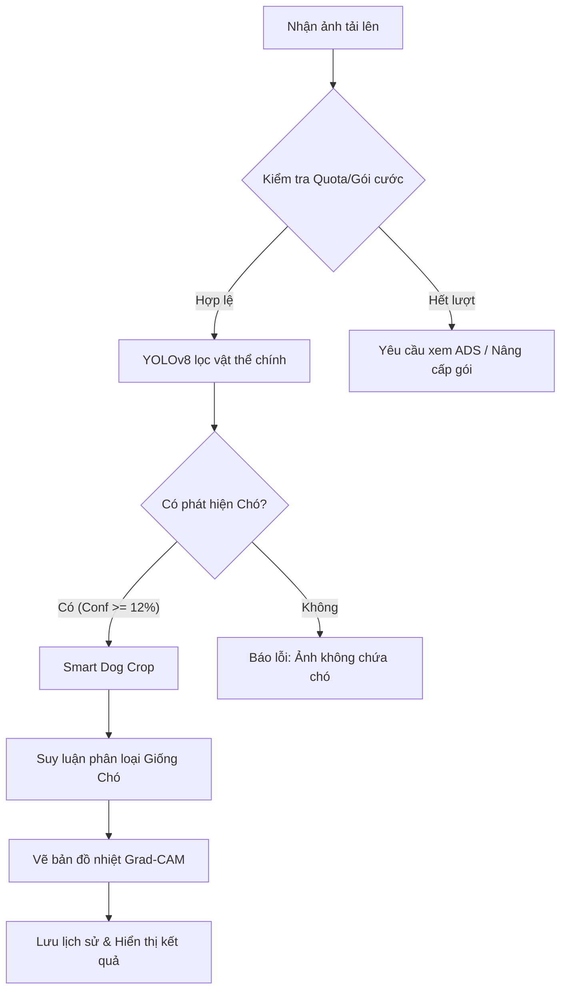

# 🐾 PetAI - Hệ Thống Nhận Diện Giống Chó & Quản Lý Dịch Vụ Thanh Toán Tự Động

[](https://www.python.org/)
[](https://flask.palletsprojects.com/)
[](https://github.com/ultralytics/ultralytics)
[](LICENSE)

**PetAI** là một ứng dụng web hiện đại và tối ưu được xây dựng trên nền tảng **Flask**, tích hợp các mô hình học sâu tiên tiến (Deep Learning) để nhận diện giống chó từ hình ảnh tải lên. Hệ thống sở hữu đầy đủ các tính năng phục vụ mục đích thương mại hóa dịch vụ như: quản lý hạn mức sử dụng (Quota), hệ thống gói cước dịch vụ cao cấp, xem quảng cáo nhận lượt nhận diện miễn phí, cùng cổng thanh toán tự động qua mã VietQR tích hợp Webhook kiểm tra giao dịch thời gian thực từ SePay.

---

## 🌟 Tính Năng Nổi Bật

### 🧠 Trí Tuệ Nhân Tạo & Thị Giác Máy Tính (AI/CV)
*   **Bộ lọc thông minh YOLOv8 (`yolov8s.pt`):** Tự động phát hiện vùng chứa chó trong ảnh với độ chính xác cao và loại bỏ các ảnh không hợp lệ (ví dụ: vật dụng hoặc động vật khác không phải chó).
*   **Cắt ảnh thông minh (Smart Dog Crop):** Sau khi xác định được vùng chứa chó, hệ thống tự động cắt ảnh tập trung vào đối tượng để tối ưu hóa đầu vào cho mô hình phân loại giống chó.
*   **Nhận diện giống chó chuyên sâu:** Sử dụng mô hình phân loại được huấn luyện trên các bộ dữ liệu chuẩn như Stanford Dogs.
*   **Grad-CAM Heatmaps:** Vẽ bản đồ nhiệt mức độ tập trung đặc trưng hình thái để trực quan hóa vùng trọng tâm mà AI sử dụng nhằm ra quyết định phân loại.
*   **Mô hình Fallback HOG + SVM:** Hỗ trợ mô hình xử lý ảnh truyền thống làm giải pháp dự phòng hiệu năng nhẹ.

### 💳 Quản Lý Hạn Mức & Thanh Toán Thông Minh
*   **Kiểm soát hạn mức (Quota Gate):** Tự động trừ lượt nhận diện khi thực hiện phân tích dựa theo phân quyền người dùng và cấp độ gói dịch vụ.
*   **Cơ chế xem quảng cáo nhận lượt:** Người dùng miễn phí có thể xem tối đa 3 quảng cáo mỗi ngày để mở khóa thêm các lượt nhận diện phụ (mỗi lần xem nhận thêm 3 lượt).
*   **Hệ thống gói cước dịch vụ đa cấp:** Hỗ trợ các gói cước `basic`, `pro`, và `enterprise` với thời gian hiệu lực và số lượt sử dụng được tối ưu hóa.
*   **Thanh toán VietQR tự động:** Sinh mã thanh toán QR chuẩn EMVCo có sẵn nội dung chuyển khoản mã hóa hóa đơn.
*   **Webhook SePay tự động:** Tự động lắng nghe thông tin chuyển khoản từ ngân hàng, khớp mã hóa đơn và kích hoạt gói cước ngay lập tức mà không cần xác nhận thủ công từ Admin.

### 🌐 Trải Nghiệm Người Dùng Cao Cấp (UX Premium)
*   **PJAX Router:** Cơ chế tải trang mượt mà không cần reload lại toàn bộ trang web (Single Page App experience).
*   **Hệ thống Theme động:** Hỗ trợ giao diện Sáng/Tối (Light/Dark mode) cùng cơ chế đồng bộ tự động với ứng dụng Flutter di động.
*   **Hỗ trợ Đa ngôn ngữ (i18n):** Chuyển đổi linh hoạt giữa Tiếng Việt 🇻🇳 và Tiếng Anh 🇺🇸 bằng cơ chế xử lý ở cả Client & Server.
*   **Đăng nhập linh hoạt:** Đăng nhập thông thường kết hợp Google OAuth.

---

## 🛠️ Công Nghệ Sử Dụng

*   **Backend:** Python 3.10+, Flask, Blueprint, Jinja2 Templates.
*   **Database:** MySQL (sử dụng thư viện `pymysql` kết hợp Connection Pool).
*   **AI Frameworks:** Ultralytics (YOLOv8), OpenCV, PyTorch, Scikit-learn (HOG+SVM fallback).
*   **Thanh Toán:** VietQR EMVCo Payload, SePay Webhook Integration.
*   **Frontend:** HTML5, TailwindCSS v4, Vanilla Javascript, Chart.js.

---

## 📂 Cấu Trúc Dự Án

```text
├── app.py                     # File chạy chính của ứng dụng Flask
├── config.py                  # Cấu hình hệ thống (Upload folder, VietQR, Google Client ID...)
├── connect.py                 # Quản lý kết nối Database MySQL
├── models.py                  # Định nghĩa các mô hình dữ liệu (User, Quota, Payment, Webhook...)
├── predict.py                 # Triển khai mô hình ImagePredictor (suy luận YOLO & HOG+SVM)
├── upload.py                  # Blueprint xử lý luồng upload ảnh, quota và thanh toán
├── vietqr.py                  # Module tạo payload QR thanh toán theo chuẩn EMVCo
├── jwt_utils.py               # Tiện ích tạo JWT Token và Mobile Deeplink
├── init_db.py                 # Script tự động khởi tạo cơ sở dữ liệu
├── schema.sql                 # File định nghĩa cấu trúc DB MySQL
├── routes/
│   ├── sepay.py               # Xử lý Webhook giao dịch tự động SePay
│   ├── health.py              # Route giám sát sức khỏe ứng dụng (/health)
│   └── legal.py               # Điều khoản dịch vụ và chính sách bảo mật
├── static/
│   ├── js/
│   │   ├── script.js          # Router PJAX, điều khiển Sidebar và logic giao diện
│   │   ├── i18n.js            # Xử lý đa ngôn ngữ ở phía client
│   │   └── toasts.js          # Hệ thống hiển thị thông báo popup nổi
│   ├── css/                   # Tập hợp file CSS và theme giao diện
│   └── uploads/               # Nơi lưu trữ ảnh do người dùng tải lên
└── templates/                 # Các file giao diện HTML (Jinja2)
```

---

## ⚙️ Cấu Hình Môi Trường (.env)

Tạo file `.env` tại thư mục gốc dự án và thiết lập các tham số cấu hình sau:

```env
# Flask Secret Key
FLASK_SECRET_KEY=YourSuperSecretKeyHere

# Cấu hình Database MySQL
MYSQL_HOST=localhost
MYSQL_PORT=3306
MYSQL_USER=root
MYSQL_PASSWORD=your_mysql_password
MYSQL_DATABASE=khoaluantn

# Cấu hình Cổng Google OAuth (Đăng nhập Google)
GOOGLE_CLIENT_ID=your_google_client_id.apps.googleusercontent.com
GOOGLE_CLIENT_SECRET=your_google_client_secret

# Cấu hình tài khoản ngân hàng nhận thanh toán (VietQR)
VIETQR_BANK_NAME=Vietcombank
VIETQR_BANK_BIN=970436
VIETQR_ACCOUNT_NUMBER=1234567890
VIETQR_ACCOUNT_NAME=NGUYEN VAN A
VIETQR_MERCHANT_NAME=PETAI SERVICES
VIETQR_MERCHANT_CITY=HANOI

# Cấu hình Tự động/Xác nhận Thủ công
ALLOW_MANUAL_TRANSFER_CONFIRM=True
AUTO_CONFIRM_ON_USER_CONFIRM=False

# API SePay
SEPAY_API_KEY=your_sepay_api_key
SEPAY_QR_API=https://qr.sepay.vn
```

---

## 🚀 Hướng Dẫn Cài Đặt & Chạy Ứng Dụng

### Bước 1: Khởi tạo và kích hoạt môi trường ảo
```bash
# Windows
python -m venv venv
venv\Scripts\activate

# Linux/macOS
python3 -m venv venv
source venv/bin/activate
```

### Bước 2: Cài đặt các thư viện cần thiết
```bash
pip install -r requirements.txt
```

### Bước 3: Khởi tạo Cơ sở dữ liệu MySQL
1. Khởi động MySQL Server trên máy tính.
2. Tạo database với tên trùng khớp với cấu hình trong `.env` (ví dụ: `khoaluantn`).
3. Chạy script để khởi tạo các bảng dữ liệu tự động:
```bash
python init_db.py
```
> [!NOTE]
> Bạn cũng có thể import trực tiếp file `schema.sql` vào MySQL Client:
> `mysql -u root -p khoaluantn < schema.sql`

### Bước 4: Khởi động ứng dụng Flask
```bash
python app.py
```
Ứng dụng sẽ chạy tại địa chỉ mặc định: [http://127.0.0.1:5000](http://127.0.0.1:5000)

---

## 👥 Cấu Trúc Phân Quyền & Gói Cước

### 1. Phân Quyền Người Dùng

| Vai Trò | Phạm Vi Chức Năng |
| :--- | :--- |
| **USER** | Tải ảnh nhận diện giống chó, xem lịch sử & thống kê phân tích cá nhân, cập nhật cài đặt hiển thị, thực hiện mua và nâng cấp các gói cước dịch vụ cao cấp. |
| **ADMIN** | Quản lý danh sách thành viên (khóa/mở khóa/xóa tài khoản), duyệt đơn chuyển khoản thủ công từ người dùng, quản lý hệ thống đơn cước. |

> [!TIP]
> Bạn có thể chuyển tài khoản bất kỳ thành Admin bằng cách chạy câu lệnh SQL trực tiếp:
> ```sql
> UPDATE users SET role = 'admin' WHERE username = 'ten_tai_khoan';
> ```

### 2. Các Cấp Độ Gói Cước Dịch Vụ

| Gói Cước | Giá Tiền | Thời Hạn | Hạn Mức Lượt Quét | Cơ Chế Quảng Cáo |
| :--- | :--- | :--- | :--- | :--- |
| **FREE** | 0 VND | Vĩnh viễn | 10 lượt quét đầu tiên | Có thể xem tối đa 3 ads/ngày để cộng thêm 3 lượt quét/mỗi lần xem. |
| **BASIC** | 1.000 VND | 7 ngày | 50 lượt quét | Không hiển thị quảng cáo. |
| **PRO** | 5.000 VND | 30 ngày | 200 lượt quét | Không hiển thị quảng cáo. |
| **ENTERPRISE** | 15.000 VND | 90 ngày | Không giới hạn | Không hiển thị quảng cáo. |

---

## 🔄 Quy Trình Xử Lý AI Nhận Diện Giống Chó

Khi một tệp ảnh được gửi lên hệ thống thông qua `POST /predict/upload`:



---

## 💳 Quy Trình Thanh Toán & Gia Hạn Gói Cước

Hệ thống hỗ trợ cơ chế thanh toán tự động tiện lợi cho người dùng:

1. **Tạo hóa đơn:** Người dùng chọn gói tại trang Nâng cấp và nhấn "Thanh toán". Hệ thống tạo mã đơn hàng dạng ngẫu nhiên duy nhất (ví dụ: `DOGAI PRO a1b2c3d4`) và tạo một hóa đơn trạng thái `pending` trong cơ sở dữ liệu.
2. **Quét mã VietQR:** Hệ thống hiển thị trang thanh toán chứa mã QR chuyển khoản động. Mã QR này chứa đầy đủ thông tin tài khoản đích của bạn, số tiền chính xác, kèm mã chuyển khoản là thông tin hóa đơn.
3. **Thanh toán tự động:** 
    *   Người dùng thực hiện chuyển khoản thông qua ứng dụng Mobile Banking của họ.
    *   Sau khi tiền được ghi nhận, **SePay** sẽ phát một Webhook tới endpoint `/webhook/sepay` của ứng dụng.
    *   Ứng dụng nhận dữ liệu giao dịch, giải mã nội dung chuyển khoản để lấy mã hóa đơn, đối soát số tiền và cập nhật trạng thái đơn hàng thành `paid`.
    *   Hệ thống tự động kích hoạt và cập nhật cấp độ gói dịch vụ mới cho tài khoản người dùng ngay lập tức.
4. **Xác nhận thủ công (Backup):** Người dùng có thể nhấn nút "Tôi đã chuyển tiền" trên trang thanh toán. Một yêu cầu phê duyệt sẽ gửi tới Admin Panel để quản trị viên đối soát trực tiếp và phê duyệt thủ công.

---

## 🤖 Huấn Luyện Mô Hình Phân Loại (Tùy Chọn)

Hệ thống hỗ trợ mở rộng nhận diện giống chó bằng cách huấn luyện mô hình YOLOv8 hoặc HOG + SVM mới.

### 1. Chuẩn bị dữ liệu
Cấu trúc cây thư mục dữ liệu huấn luyện:
```text
dataset/
  ├── Dog/
  │    ├── corgi/
  │    │    ├── image1.jpg
  │    │    └── image2.jpg
  │    └── husky/
  └── Cat/
```

### 2. Huấn luyện bộ phân loại HOG + SVM
Chạy lệnh sau để trích xuất đặc trưng ảnh HOG và huấn luyện phân loại giống bằng SVM:
```bash
python train.py dataset/ --models-dir models
```
Bộ trọng số huấn luyện xong sẽ được lưu tại thư mục `models/` gồm `species_svm.joblib`, `breed_svm.joblib`, và `breed_labels.joblib`.

### 3. Huấn luyện giống chuyên sâu bằng YOLOv8
Chuyển đổi dataset sang định dạng YOLO:
```bash
python scripts/stanford_dogs_to_yolo.py --images-root <Stanford_Dogs_Root> --output-root <YOLO_Dataset_Root> --val-ratio 0.2
```
Chạy huấn luyện mô hình YOLOv8:
```bash
python scripts/train_yolov8_breed.py --data <YOLO_Dataset_Root>/data.yaml --model yolov8n.pt --epochs 100 --imgsz 640 --name breeds
```
Tập tin trọng số tốt nhất `best.pt` trong thư mục `runs/detect/breeds/weights/` sẽ tự động được hệ thống quét và áp dụng khi ứng dụng chạy.

---

## 🛡️ Hướng Dẫn Vận Hành An Toàn

*   **Bảo mật Private Key:** Hãy đảm bảo `FLASK_SECRET_KEY` trong môi trường Production luôn được thay đổi sang một chuỗi ký tự ngẫu nhiên phức tạp, thay vì các giá trị mặc định.
*   **Idempotency Webhook:** Endpoint webhook `/webhook/sepay` đã có bộ lọc trùng lặp tự động dựa vào mã giao dịch giao dịch `sepay_tx_id` để tránh việc xử lý lặp lại giao dịch gây cộng trùng gói.
*   **Quản lý lưu trữ:** Ảnh do người dùng tải lên được lưu giữ tại `static/uploads/`. Vui lòng cấu hình các tác vụ tự động dọn dẹp định kỳ (cron job) để giải phóng dung lượng bộ nhớ cho máy chủ.
