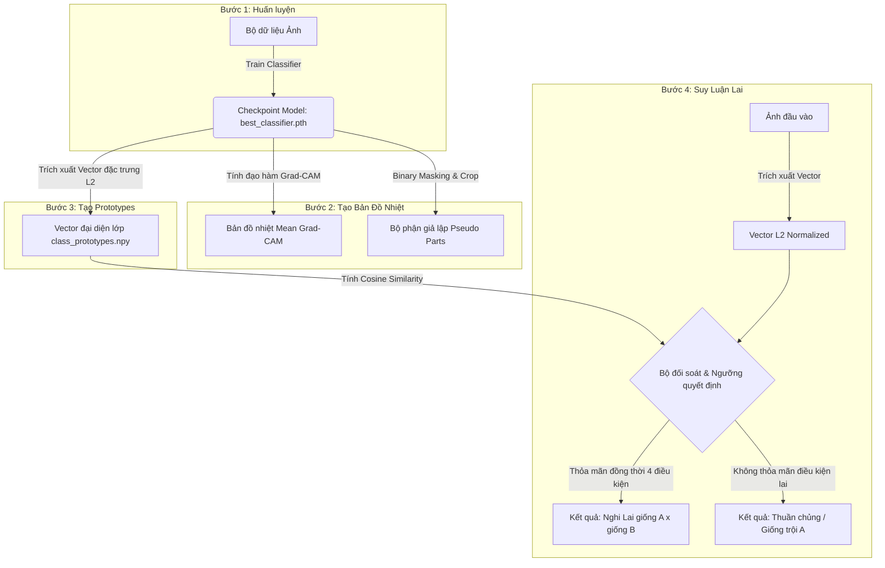

# 🚀 Google Colab Hybrid 4-Step Pipeline — Hướng Dẫn Từng Bước Từ A - Z

[](https://colab.research.google.com/)
[](https://pytorch.org/)
[](https://github.com/lukemelas/EfficientNet-PyTorch)

> **Khuyên dùng:** Sử dụng mô hình xương sống (backbone) **EfficientNet-B0** để tối ưu hóa giữa độ chính xác và tài nguyên GPU/RAM trên Google Colab miễn phí.
> 
> **Mục tiêu:** Sao chép đúng từng ô mã (cell) trong tài liệu này theo thứ tự từ **A đến H** để thiết lập, huấn luyện và chạy thử nghiệm suy luận mô hình lai hình thái học thành công.

---

## 📐 Kiến Trúc Quy Trình 4 Bước (Hybrid 4-Step)

Quy trình sử dụng một mô hình xương sống CNN duy nhất (**EfficientNet-B0** hoặc **ResNet50**) để học đặc trưng, trích xuất vector nhúng đặc trưng, xây dựng các vector đại diện (prototypes), và thực hiện suy luận lai hình thái học:



---

## 🛠️ Chi Tiết Thuật Toán Quyết Định Lai Hình Thái Học

Thuật toán thực hiện đối soát vector đặc trưng của ảnh đầu vào với các vector đại diện giống (Prototypes) thông qua **Cosine Similarity** ($\cos(\hat{e},\hat{p}_c)=\hat{p}_c^\top\hat{e}$):

*   **$s_1, s_2$:** Điểm tương đồng của giống có xác suất cao nhất (Top-1) và thứ nhì (Top-2).
*   **`gap`:** Khoảng cách tuyệt đối ($s_1 - s_2$).
*   **`ratio`:** Tỷ lệ tương quan ($s_2 / s_1$).
*   **`mean`:** Điểm trung bình của hai giống đầu ($(s_1 + s_2) / 2$).

### 4 Điều Kiện Cần Và Đủ Để Gắn Nhãn "Nghi Lai"

Hệ thống sẽ kết luận ảnh cún cưng có **nghi vấn lai hình thái** nếu thỏa mãn đồng thời cả 4 điều kiện sau:

1.  **`C1 (s1 >= min_score)`:** Giống Top-1 phải đủ độ tương đồng tối thiểu (tránh nhận diện sai ảnh rác ngoài tập dữ liệu).
2.  **`C2 (s2 >= min_score_2)`:** Giống Top-2 phải đủ tin cậy, không phải là kết quả ngẫu nhiên do nhiễu.
3.  **`C3 (gap <= effective_max_gap)`:** Khoảng cách giữa Top-1 và Top-2 đủ hẹp, trong đó:
    $$\text{effective\_max\_gap} = \min(\text{max\_gap}, (1 - \text{min\_ratio}) \times s_1)$$
4.  **`C4 (mean >= min_mean_score)`:** Điểm trung bình cả hai giống phải đủ lớn để tránh trường hợp cả hai giống đều có điểm thấp nhưng vẫn nằm sát nhau (ví dụ ảnh chụp bị mờ/tối).

> [!NOTE]
> Nếu bất kỳ điều kiện nào trong 4 điều kiện trên bị vi phạm, hệ thống tự động kết luận cún cưng thuộc **Giống thuần chủng / Giống trội** của giống Top-1.

### Bảng Ngưỡng Profile Cấu Hình Sẵn

| Profile | `min_score` (C1) | `min_score_2` (C2) | `max_gap` (C3) | `min_ratio` (C3) | `min_mean_score` (C4) |
| :--- | :---: | :---: | :---: | :---: | :---: |
| **`strict`** (Khắt khe) | 0.70 | 0.70 | 0.08 | 0.90 | 0.60 |
| **`balanced`** (Cân bằng) | 0.55 | 0.50 | 0.12 | 0.88 | 0.53 |
| **`sensitive`** (Nhạy) | 0.40 | 0.35 | 0.15 | 0.85 | 0.45 |

---

## 📝 Mã Nguồn Chạy Trên Google Colab

### A) Chuẩn Bị Trên Google Drive
Trong tài khoản Drive cá nhân, bạn hãy tạo thư mục tên `DogHybrid` trong thư mục gốc (`MyDrive/DogHybrid/`) và tải lên đúng 2 tệp sau:
1.  `dog-breeds-dataset.zip` (Tệp nén chứa tập dữ liệu ảnh).
2.  `hybrid_breed_pipeline.py` (Mã nguồn Python thực thi các luồng chạy).

---

### B) Ô mã 1: Khởi Tạo Môi Trường Colab (Chạy 1 lần duy nhất)
```python
# Cài đặt các thư viện cần thiết
!pip -q install torch torchvision opencv-python tqdm pillow matplotlib

# Liên kết Google Drive
from google.colab import drive
drive.mount('/content/drive')

# Tạo thư mục làm việc trên Colab
!mkdir -p /content/project

# Giải nén tập dữ liệu (không hiển thị log dài dòng)
!unzip -oq "/content/drive/MyDrive/DogHybrid/dog-breeds-dataset.zip" -d /content/project

# Loại bỏ thư mục .git nếu có để tránh lỗi nạp dữ liệu PyTorch
!rm -rf /content/project/dog-breeds-dataset/.git

# Sao chép tệp mã nguồn từ Drive vào Colab
!cp -f "/content/drive/MyDrive/DogHybrid/hybrid_breed_pipeline.py" /content/project/

# Di chuyển thư mục làm việc và kiểm tra trợ giúp lệnh
%cd /content/project
!python hybrid_breed_pipeline.py --help
```

---

### C) Ô mã 2: Huấn Luyện Mới
```python
!python hybrid_breed_pipeline.py train \
  --data-dir "/content/project/dog-breeds-dataset" \
  --output-dir "/content/drive/MyDrive/DogHybrid/outputs/classifier" \
  --arch efficientnet_b0 \
  --epochs 60 \
  --batch-size 32 \
  --img-size 260 \
  --label-smoothing 0.05 \
  --min-lr 1e-6 \
  --early-stop-patience 15 \
  --amp \
  --workers 1 \
  --device 0
```

---

### D) Ô mã 3: Huấn Luyện Tiếp Tục (Khi bị ngắt kết nối / sập phiên)
```python
!python hybrid_breed_pipeline.py train \
  --data-dir "/content/project/dog-breeds-dataset" \
  --output-dir "/content/drive/MyDrive/DogHybrid/outputs/classifier" \
  --arch efficientnet_b0 \
  --epochs 60 \
  --batch-size 32 \
  --img-size 260 \
  --label-smoothing 0.05 \
  --min-lr 1e-6 \
  --early-stop-patience 15 \
  --amp \
  --workers 1 \
  --device 0 \
  --resume
```

---

### E) Ô mã 4: Kiểm Tra Tệp Huấn Luyện Đã Lưu Trên Drive
```python
!ls -lah "/content/drive/MyDrive/DogHybrid/outputs/classifier"
```
> [!IMPORTANT]
> Danh sách thư mục phải xuất hiện ít nhất 3 tệp tin sau:
> *   `last_classifier.pth` (Checkpoint lưu liên tục sau mỗi epoch).
> *   `best_classifier.pth` (Checkpoint lưu mô hình tốt nhất).
> *   `class_to_idx.json` (Ánh xạ nhãn phân loại).

---

### F) Ô mã 5: Chạy Trích Xuất Bản Đồ Nhiệt Grad-CAM & Cắt Pseudo Parts
```python
!python hybrid_breed_pipeline.py gradcam \
  --data-dir "/content/project/dog-breeds-dataset" \
  --ckpt "/content/drive/MyDrive/DogHybrid/outputs/classifier/best_classifier.pth" \
  --heatmap-out "/content/drive/MyDrive/DogHybrid/outputs/gradcam_mean" \
  --parts-out "/content/drive/MyDrive/DogHybrid/outputs/pseudo_parts" \
  --max-per-class 150 \
  --threshold 0.65 \
  --save-individual-parts \
  --workers 1 \
  --device 0
```

---

### G) Ô mã 6: Xây Dựng Vector Đại Diện (Build Class Prototypes)
```python
!python hybrid_breed_pipeline.py prototypes \
  --data-dir "/content/project/dog-breeds-dataset" \
  --ckpt "/content/drive/MyDrive/DogHybrid/outputs/classifier/best_classifier.pth" \
  --output-dir "/content/drive/MyDrive/DogHybrid/outputs/prototypes" \
  --batch-size 128 \
  --workers 1 \
  --device 0
```

---

### H) Ô mã 7: Chạy Suy Luận Thử Nghiệm Ảnh Ngẫu Nhiên
```python
# Lấy ngẫu nhiên 1 ảnh trong bộ dữ liệu
import glob, random
imgs = glob.glob("/content/project/dog-breeds-dataset/*/*.*")
test_img = random.choice(imgs)
print("Ảnh chạy thử nghiệm ngẫu nhiên được chọn:", test_img)
```

```python
# Thực hiện suy luận dự đoán giống
!python hybrid_breed_pipeline.py infer \
  --image "$test_img" \
  --ckpt "/content/drive/MyDrive/DogHybrid/outputs/classifier/best_classifier.pth" \
  --prototypes "/content/drive/MyDrive/DogHybrid/outputs/prototypes/class_prototypes.npy" \
  --topk 5 \
  --min-score 0.70 \
  --max-gap 0.08 \
  --device 0
```

```python
# Trực quan hóa ảnh thử nghiệm vừa chạy
import matplotlib.pyplot as plt
from PIL import Image

img = Image.open(test_img).convert("RGB")
plt.figure(figsize=(6, 6))
plt.imshow(img)
plt.axis("off")
plt.title("Nhãn Gốc: " + test_img.split("/")[-2])
plt.show()
```

---

## 🚑 Khắc Phục Lỗi Nhanh (Troubleshooting)

### 1. Lỗi: `End-of-central-directory signature not found`
*   **Nguyên nhân:** Lệnh giải nén `unzip` đang trỏ nhầm tệp nguồn `.py` thay vì tệp zip dataset.
*   **Khắc phục:** Đảm bảo tệp dataset là `.zip` và tệp code được copy bằng lệnh `!cp` như trong bước B.

### 2. Lỗi: Bị hỏi ghi đè tệp `replace ... ? [y]es, [n]o...`
*   **Nguyên nhân:** Chạy lại lệnh giải nén zip nhiều lần làm gián đoạn luồng tự động do chờ input.
*   **Khắc phục:** Sử dụng cờ `-oq` trong lệnh unzip (ví dụ: `!unzip -oq ...`) để giải nén đè và ẩn toàn bộ hộp thoại xác nhận.

### 3. Lỗi: `Found no valid file for the classes .git`
*   **Nguyên nhân:** PyTorch nạp dữ liệu phát hiện thư mục quản lý mã nguồn ẩn `.git` trong thư mục dữ liệu ảnh.
*   **Khắc phục:** Chạy lệnh xóa triệt để: `!rm -rf /content/project/dog-breeds-dataset/.git` trước khi train.

### 4. Lỗi: Tràn bộ nhớ GPU / RAM (Out of Memory)
*   **Khắc phục:**
    *   Giảm kích thước Batch Size (`--batch-size`) xuống còn `8` hoặc `16`.
    *   Giảm số lượng xử lý đa luồng (`--workers`) về `1`.
    *   Giảm kích thước ảnh đầu vào (`--img-size 224` hoặc `192`).
