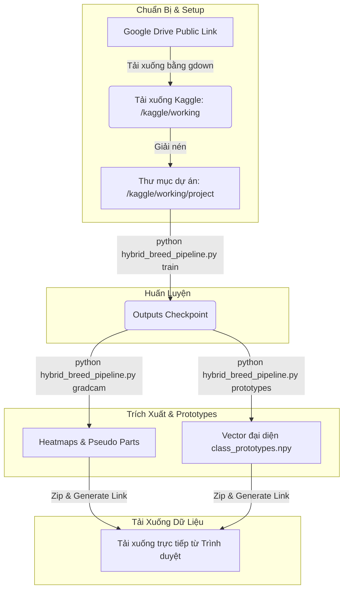

# ⚡ Kaggle Hybrid 4-Step Pipeline — Hướng Dẫn Từng Bước Từ A - Z

[](https://www.kaggle.com/)
[](https://pytorch.org/)
[](https://github.com/lukemelas/EfficientNet-PyTorch)

> **Khuyên dùng:** Sử dụng mô hình xương sống (backbone) **EfficientNet-B0** để tối ưu hóa giữa tốc độ huấn luyện và giới hạn phần cứng trên môi trường Kaggle Notebook.
> 
> **Mục tiêu:** Sao chép chính xác từng ô mã (cell) trong tài liệu này theo thứ tự từ **A đến H** để thiết lập dữ liệu, huấn luyện trên GPU T4, lưu trữ và suy luận mô hình lai thành công.

---

## 📐 Quy Trình Thuật Toán & Luồng Xử Lý trên Kaggle

Pipeline này sử dụng **mô hình EfficientNet-B0** để huấn luyện phân loại, trích xuất đặc trưng ($L_2$ normalized embeddings) và tính toán độ tương đồng Cosine để xác định giống thuần chủng hoặc ước tính tỷ lệ lai hình thái học.



---

## 📝 Mã Nguồn Chạy Trên Kaggle Notebook

### A) Chuẩn Bị Trên Google Drive
Bạn cần có đúng 2 tệp tin được đặt ở chế độ công khai (để quyền **Anyone with the link / Bất kỳ ai có liên kết đều có thể đọc**):
1.  `dog-breeds-dataset.zip` (Tệp nén chứa tập dữ liệu ảnh).
2.  `hybrid_breed_pipeline.py` (Mã nguồn thực thi pipeline).

> [!WARNING]
> Tệp `hybrid_breed_pipeline.py` là mã nguồn Python, **KHÔNG** nén chung vào tệp zip.

---

### B) Ô mã 1: Thiết Lập Môi Trường Kaggle (Chạy 1 lần duy nhất)
```python
# Cập nhật pip và cài đặt các thư viện cần thiết
!pip -q install --upgrade pip
!pip -q install gdown torch torchvision opencv-python tqdm pillow matplotlib

import os, shutil
import gdown

# ====================================================
# ĐIỀN ĐƯỜNG DẪN LIÊN KẾT GOOGLE DRIVE CỦA BẠN VÀO ĐÂY
# ====================================================
DATASET_ZIP_LINK = "https://drive.google.com/file/d/REPLACE_DATASET_ID/view?usp=sharing"
PIPELINE_PY_LINK = "https://drive.google.com/file/d/REPLACE_SCRIPT_ID/view?usp=sharing"

WORK_DIR = "/kaggle/working/project"
DATASET_DIR = f"{WORK_DIR}/dog-breeds-dataset"

# Dọn dẹp thư mục làm việc cũ nếu có
if os.path.exists(WORK_DIR):
    shutil.rmtree(WORK_DIR)
os.makedirs(WORK_DIR, exist_ok=True)

dataset_zip = "/kaggle/working/dog-breeds-dataset.zip"
pipeline_py = f"{WORK_DIR}/hybrid_breed_pipeline.py"

# Tiến hành tải xuống từ Google Drive
print("Đang tải dữ liệu và mã nguồn...")
gdown.download(DATASET_ZIP_LINK, dataset_zip, quiet=False, fuzzy=True)
gdown.download(PIPELINE_PY_LINK, pipeline_py, quiet=False, fuzzy=True)

# Giải nén tập dữ liệu
!unzip -oq "$dataset_zip" -d "$WORK_DIR"

# Loại bỏ thư mục .git để tránh lỗi nạp dữ liệu PyTorch
!rm -rf "$DATASET_DIR/.git"

# Di chuyển và kiểm tra tập lệnh
%cd $WORK_DIR
!python hybrid_breed_pipeline.py --help
```

---

### C) Ô mã 2: Huấn Luyện Mới Trên GPU Kaggle
```python
!python hybrid_breed_pipeline.py train \
    --data-dir "/kaggle/working/project/dog-breeds-dataset" \
    --output-dir "/kaggle/working/outputs/classifier" \
    --arch efficientnet_b0 \
    --epochs 60 \
    --batch-size 32 \
    --img-size 260 \
    --label-smoothing 0.05 \
    --min-lr 1e-6 \
    --early-stop-patience 15 \
    --amp \
    --workers 1 \
    --device 0
```

---

### D) Ô mã 3: Huấn Luyện Tiếp Tục (Khi bị reset phiên / sập Kaggle)
> [!IMPORTANT]
> Vì thư mục `/kaggle/working` sẽ bị xóa sạch khi đóng phiên. Nếu muốn tiếp tục huấn luyện (resume), bạn cần tải lại checkpoint `last_classifier.pth` từ phiên trước đặt vào đúng đường dẫn đầu ra trước khi chạy lệnh dưới đây.

```python
!python hybrid_breed_pipeline.py train \
    --data-dir "/kaggle/working/project/dog-breeds-dataset" \
    --output-dir "/kaggle/working/outputs/classifier" \
    --arch efficientnet_b0 \
    --epochs 60 \
    --batch-size 32 \
    --img-size 260 \
    --label-smoothing 0.05 \
    --min-lr 1e-6 \
    --early-stop-patience 15 \
    --amp \
    --workers 1 \
    --device 0 \
    --resume
```

---

### E) Ô mã 4: Kiểm Tra Tệp Checkpoint Đã Lưu
```python
!ls -lah "/kaggle/working/outputs/classifier"
```
Danh sách tệp tin hiển thị tối thiểu phải gồm:
*   `last_classifier.pth` (Lưu checkpoint epoch gần nhất).
*   `best_classifier.pth` (Lưu checkpoint có val_acc cao nhất).
*   `class_to_idx.json` (Ánh xạ nhãn phân loại giống chó).

---

### F) Ô mã 5: Tạo Bản Đồ Nhiệt Grad-CAM & Cắt Pseudo Parts
```python
!python hybrid_breed_pipeline.py gradcam \
    --data-dir "/kaggle/working/project/dog-breeds-dataset" \
    --ckpt "/kaggle/working/outputs/classifier/best_classifier.pth" \
    --heatmap-out "/kaggle/working/outputs/gradcam_mean" \
    --parts-out "/kaggle/working/outputs/pseudo_parts" \
    --max-per-class 150 \
    --threshold 0.65 \
    --save-individual-parts \
    --workers 1 \
    --device 0
```

---

### G) Ô mã 6: Xây Dựng Vector Đại Diện (Build Class Prototypes)
```python
!python hybrid_breed_pipeline.py prototypes \
    --data-dir "/kaggle/working/project/dog-breeds-dataset" \
    --ckpt "/kaggle/working/outputs/classifier/best_classifier.pth" \
    --output-dir "/kaggle/working/outputs/prototypes" \
    --batch-size 128 \
    --workers 1 \
    --device 0
```

---

### H) Ô mã 7: Chạy Suy Luận Thử Nghiệm Trên Tập Dữ Liệu
```python
# Lấy ngẫu nhiên 1 ảnh để thử nghiệm
import glob, random
imgs = glob.glob("/kaggle/working/project/dog-breeds-dataset/*/*.*")
test_img = random.choice(imgs)
print("Ảnh thử nghiệm ngẫu nhiên được chọn:", test_img)
```

```python
# Chạy suy luận nhận diện giống thuần chủng / lai
!python hybrid_breed_pipeline.py infer \
    --image "$test_img" \
    --ckpt "/kaggle/working/outputs/classifier/best_classifier.pth" \
    --prototypes "/kaggle/working/outputs/prototypes/class_prototypes.npy" \
    --topk 5 \
    --min-score 0.70 \
    --max-gap 0.08 \
    --device 0
```

```python
# Trực quan hóa ảnh
import matplotlib.pyplot as plt
from PIL import Image

img = Image.open(test_img).convert("RGB")
plt.figure(figsize=(6, 6))
plt.imshow(img)
plt.axis("off")
plt.title("Nhãn Gốc: " + test_img.split("/")[-2])
plt.show()
```

---

### I) Ô mã 8: Đóng Gói Toàn Bộ Checkpoints & Tải Xuống Trực Tiếp
```python
# Chạy ô mã này để nén toàn bộ thư mục outputs thành tệp zip và tải về qua trình duyệt
import os
import glob
import shutil
from IPython.display import FileLink, display

FOLDER_TO_EXPORT = "/kaggle/working/outputs"   
EXPORT_NAME = "outputs_kaggle_backup"                 

zip_base = f"/kaggle/working/{EXPORT_NAME}"
zip_path = f"{zip_base}.zip"

# Xóa các file trùng lặp cũ
for p in glob.glob(f"{zip_base}*"):
    if os.path.isfile(p):
        os.remove(p)

# Tạo file nén zip
shutil.make_archive(zip_base, "zip", FOLDER_TO_EXPORT)
size_mb = os.path.getsize(zip_path) / (1024 * 1024)
print(f"Đã tạo file nén: {zip_path} ({size_mb:.2f} MB)")

# Hiển thị đường dẫn tải xuống trực tiếp trên giao diện Kaggle Notebook
display(FileLink(zip_path))
```

---

## 🚑 Khắc Phục Lỗi Nhanh (Troubleshooting)

### 1. Lỗi: `End-of-central-directory signature not found`
*   **Nguyên nhân:** Đường dẫn chia sẻ Google Drive cho dataset bị sai định dạng, hoặc bạn chưa mở chế độ **Anyone with the link** (Công khai).
*   **Khắc phục:** Đảm bảo quyền chia sẻ tệp tin là công khai trên Drive.

### 2. Lỗi: Script không chạy sau khi tải về
*   **Nguyên nhân:** Đường dẫn tải script `hybrid_breed_pipeline.py` không hợp lệ hoặc tệp tin trên Drive không đúng định dạng đuôi `.py`.
*   **Khắc phục:** Kiểm tra lại liên kết script, đảm bảo lệnh `!python hybrid_breed_pipeline.py --help` in ra danh sách câu lệnh.

### 3. Lỗi: `Found no valid file for the classes .git`
*   **Khắc phục:** Chạy lệnh: `!rm -rf /kaggle/working/project/dog-breeds-dataset/.git` trước khi huấn luyện.

### 4. Lỗi: Tràn bộ nhớ GPU / RAM
*   **Khắc phục:** Giảm kích thước Batch Size (`--batch-size 16`), giảm số luồng (`--workers 1`), và giữ nguyên độ phân giải ảnh (`--img-size 224`).

---

## 💡 Gợi Ý Vận Hành Tốt Nhất trên Kaggle
*   **Bật Tăng Tốc Phần Cứng:** Luôn chuyển cấu hình Notebook sang **GPU T4 x2** hoặc **GPU T4** trước khi chạy huấn luyện.
*   **Save Version (Commit):** Sau khi huấn luyện kết thúc, sử dụng chức năng "Save Version" (chọn Quick Save hoặc Save & Run All) để lưu giữ lại thư mục `/kaggle/working/outputs` trước khi tắt tab trình duyệt.
